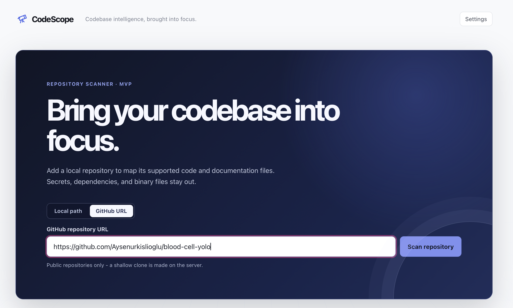
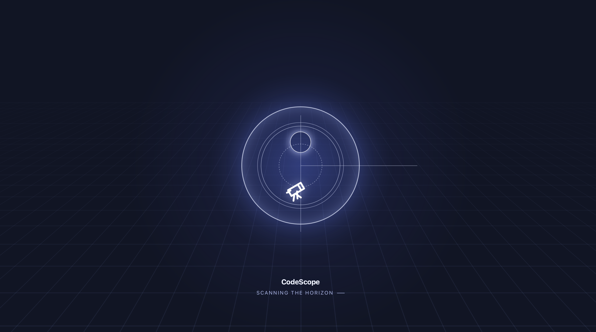
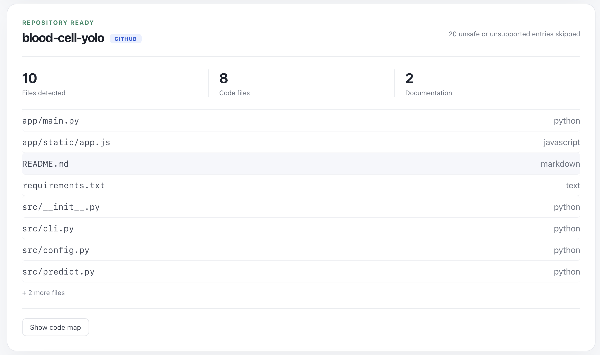
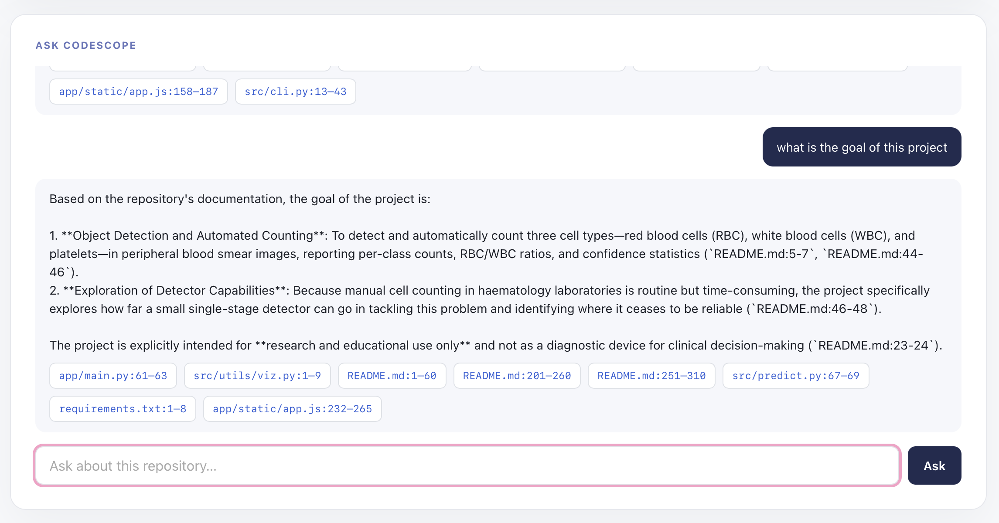
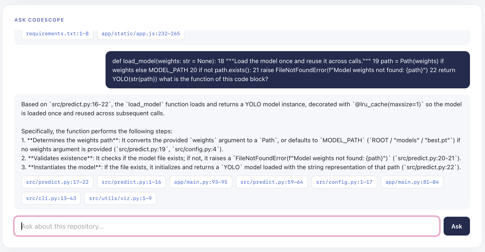

# CodeScope

> **Bring your codebase into focus.**

CodeScope is an AI-assisted codebase explorer. Point it at a local repository or a
public GitHub repository to scan its structure, inspect source files, understand
dependencies, and ask questions with citations back to the underlying code.

## Why CodeScope

Codebases are often difficult to understand before you can run them. CodeScope
creates a searchable, explainable view of a repository without requiring the user
to manually map its files first.

- Scan local repositories or shallow-clone public GitHub repositories.
- Identify supported source, documentation, and text files while excluding secrets,
  dependencies, binaries, and oversized files.
- Browse source with syntax highlighting and cited line ranges.
- Explore Python and JavaScript/TypeScript symbols and relative import relationships.
- Search code semantically with local embeddings.
- Ask repository-specific questions and open every citation in the source viewer.
- Persist repository metadata and indexing state across backend restarts.

## Product Tour

### Repository workspace

The main workspace is designed around one clear first action: bring a repository
into focus using a local path or a public GitHub URL.



### Opening animation

The opening experience establishes the CodeScope visual language with an optic,
crosshair, glow, and perspective grid before handing control to the workspace.



### Scan results

After indexing, CodeScope presents the repository status, detected file counts,
supported file types, and an entry point to the code map.



### Cited repository questions

The chat view keeps answers grounded in retrieved repository context and exposes
the source locations used to produce each answer.





## Architecture

```text
React + Vite frontend
                      |
                      | POST /api/repositories or /api/repositories/from-github
                      v
FastAPI backend --> SQLite repository and file metadata
                      |
                      v
Background indexing --> Tree-sitter AST --> chunking --> Chroma embeddings
                      |
                      v
POST /api/repositories/{id}/chat --> semantic retrieval --> Gemini or mock mode
```

The frontend is a React and TypeScript application. The backend is built with
FastAPI and SQLAlchemy. Indexing extracts AST symbols and imports where supported,
chunks files for retrieval, and stores embeddings in a repository-specific Chroma
collection.

## Tech Stack

| Area | Technologies |
| --- | --- |
| Frontend | React, TypeScript, Vite |
| Source viewing | `react-syntax-highlighter` |
| Backend | Python, FastAPI, SQLAlchemy |
| Code intelligence | Tree-sitter for Python and JavaScript/TypeScript |
| Retrieval | ChromaDB with local embeddings |
| LLM | Google Gen AI SDK with an optional Gemini integration |
| Document support | `pypdf` for PDF text extraction |
| Testing | pytest, FastAPI `TestClient` |

## Quick Start

### Prerequisites

- Node.js and npm
- Python 3.10 or newer
- A local repository to inspect, or a public GitHub repository URL

### 1. Start the backend

```bash
cd backend
python3 -m venv .venv
source .venv/bin/activate
pip install -r requirements.txt
uvicorn app.main:app --reload
```

The API is available at `http://127.0.0.1:8000`.

### 2. Start the frontend

In a second terminal:

```bash
cd frontend
npm install
npm run dev
```

Open `http://localhost:5173` in a browser.

## Configuration

Copy `.env.example` to `.env` in the repository root or to `backend/.env` when
configuration is needed. Environment files are ignored and must not be committed.

| Variable | Description |
| --- | --- |
| `GEMINI_API_KEY` | Optional Gemini API key. Without it, chat uses grounded mock mode. |
| `GEMINI_MODEL` | Optional model name; defaults to `gemini-3.8-flash`. |
| `REPOLENS_ALLOWED_ROOT` | Optional root directory that local scans must remain inside. |
| `REPOLENS_DATABASE_URL` | Optional SQLAlchemy database URL. |
| `VITE_API_BASE_URL` | Optional frontend API base URL; defaults to `http://127.0.0.1:8000`. |

Semantic retrieval does not require an API key. Chroma downloads its local
embedding model on first use and runs embeddings on the local machine.

## Using CodeScope

1. Enter an absolute local repository path or switch to **GitHub URL** and enter a
       public repository URL.
2. Start the scan and follow indexing progress in the workspace.
3. Review detected files and open any file in the source viewer.
4. Use **Show code map** to inspect supported symbols and relative imports.
5. Ask a question in **Ask CodeScope** and open the returned citations for context.

## Supported Files and Safety Filters

The scanner currently recognizes Python, JavaScript/TypeScript, Java, C/C++, Go,
Markdown, plain text, and PDF files. It does not follow symlinks and skips:

- Environment and secret-like files such as `.env*`
- Dependency and generated directories
- Binary files
- Files larger than 1 MB

GitHub sources are shallow-cloned into the server-managed data directory. Local
scans can be restricted with `REPOLENS_ALLOWED_ROOT`.

## Testing

Run the backend test suite from the repository root:

```bash
cd backend
pytest
```

Build and lint the frontend with:

```bash
cd frontend
npm run build
npm run lint
```

## Current Scope

Tree-sitter currently extracts functions, classes, and imports for Python and
JavaScript/TypeScript. Java, C/C++, and Go files are supported by the scanner but
remain metadata-only for AST indexing. Relative imports are resolved into a
file-level dependency graph; cross-file call graphs and an interactive graph view
are not implemented yet.

## Roadmap

- Cross-file call graphs and interactive dependency visualization
- Private GitHub repository support
- Streaming chat responses
- AST and semantic support for Java, C/C++, and Go

## Repository Layout

```text
backend/             FastAPI service, scanner, indexers, persistence, and tests
frontend/            React + Vite application
docs/screenshots/    Product screenshots used in this document
```

Runtime data such as the SQLite database, Chroma collections, and cloned
repositories is stored under `backend/data/` and is gitignored.

## License

No license has been selected yet.
# CodeScope

AI Codebase Assistant. Point CodeScope at a local repository or a public GitHub URL and
it scans, persists, and indexes the codebase, then answers questions about it with
citations back to real files and line ranges.

## Features

- React + TypeScript workspace for scanning a local repository or cloning a public GitHub URL
- FastAPI API with validation and browser-friendly error messages
- Scanner for Python, JavaScript/TypeScript, Java, C/C++, Go, Markdown, text, and PDF files
- Secret-like environment files, dependency folders, binaries, and large files are excluded
- SQLite-backed persistence - repositories survive a server restart
- Source viewer with syntax highlighting and line-range highlighting
- AST-based code map (functions, classes, and import dependencies) for Python and JS/TS
- Semantic code search and an AI chat that answers questions with cited snippets

## Architecture

```text
React + Vite UI
       |
       | POST /api/repositories | /from-github
       v
FastAPI scanner --> SQLite (repositories, files, symbols, imports)
       |
       v
Background indexing: Tree-sitter AST --> chunking --> Chroma (local embeddings)
       |
       v
POST /chat --> semantic search --> Gemini (or mock mode without a key) --> cited answer
```

## Tech Stack

- Frontend: React, Vite, TypeScript, `react-syntax-highlighter`
- Backend: Python, FastAPI, SQLAlchemy (SQLite), Tree-sitter, ChromaDB, pypdf, Google Gen AI SDK
- Testing: pytest and FastAPI TestClient

## Installation

### Frontend

```bash
cd frontend
npm install
npm run dev
```

### Backend

```bash
cd backend
python3 -m venv .venv
source .venv/bin/activate
pip install -r requirements.txt
uvicorn app.main:app --reload
```

The API runs at `http://127.0.0.1:8000`; the frontend runs at `http://localhost:5173`.
A `backend/data/` directory (SQLite database, Chroma index, GitHub clones) is created
automatically on first run and is gitignored.

## Environment Variables

Copy `.env.example` to `.env` (repo root or `backend/.env`, both are read) when
configuration is needed. Never commit `.env`.

- `GEMINI_API_KEY` - optional. Without it, `/chat` runs in **mock mode**: it still
  returns real retrieved code snippets and citations, just without AI-written prose.
  Add a key to get real AI-written, cited answers - restart `uvicorn` after adding it.
  A free key (no billing required) can be created at
  [aistudio.google.com/apikey](https://aistudio.google.com/apikey).
- `GEMINI_MODEL` - optional, defaults to `gemini-3.8-flash` (free-tier eligible).
- `REPOLENS_ALLOWED_ROOT` - optional. When set, local path scans must be inside this
  directory (GitHub clones are exempt, since they're already server-managed).
- `REPOLENS_DATABASE_URL` - optional, overrides the default `sqlite:///backend/data/codescope.db`.
- `VITE_API_BASE_URL` (frontend `.env.local`) - optional, defaults to `http://127.0.0.1:8000`.

Semantic search needs no key at all: it uses Chroma's bundled local embedding model
(downloaded once, runs on-device).

## How It Works

1. Enter a local repository's absolute path, or a public GitHub URL.
2. The backend scans it (or shallow-clones it first) without following symlinks.
3. Ignored directories, `.env*` files, binary files, and files above 1 MB are skipped.
4. The repository and its file metadata are persisted to SQLite; a background task then
   extracts AST symbols/imports and builds the semantic search index, while the UI polls
   and shows indexing progress.
5. Once ready: browse files with syntax highlighting, explore the code map, or ask
   CodeScope questions about the codebase.

## Code Intelligence

Tree-sitter extracts functions, classes, and import statements for Python and JS/TS
files (matching the languages the project started with); other supported languages
(Java, C/C++, Go) stay metadata-only for now. Relative imports are resolved to actual
files in the repository, forming a file-level dependency graph (`GET .../graph`). Not
implemented: cross-file call graphs (who-calls-whom) and an interactive graph
visualization - both are listed under Future Improvements.

## RAG Pipeline

Each file is chunked (one chunk per function/class when AST symbols are available,
otherwise a sliding line window; PDFs use pypdf text extraction with a character
window), embedded locally via Chroma's bundled model, and stored in a per-repository
Chroma collection. `/chat` retrieves the most relevant chunks and asks Gemini to answer
using only those chunks, citing file paths and line ranges - or, without an API key,
returns the retrieved chunks directly as a "mock mode" answer.

## Future Improvements

- Cross-file call graphs (who calls whom) and an interactive dependency graph visualization
- Private GitHub repository support (credential/token input)
- Streaming chat responses
- AST/semantic support for Java, C/C++, and Go

## License

No license has been selected yet.
